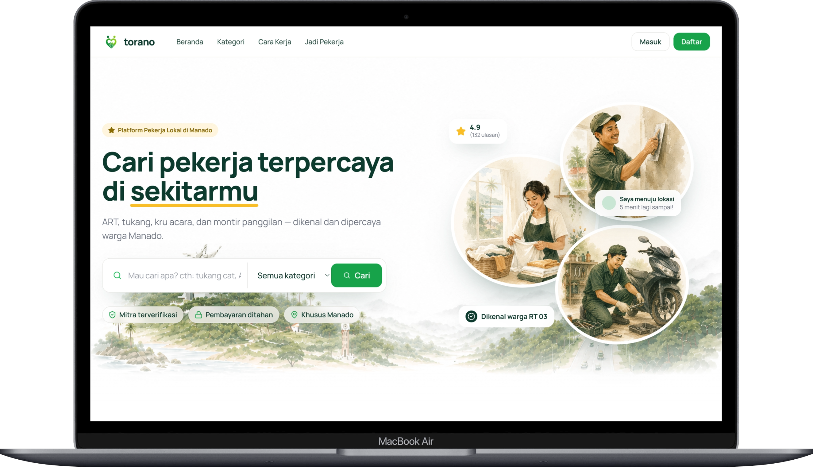
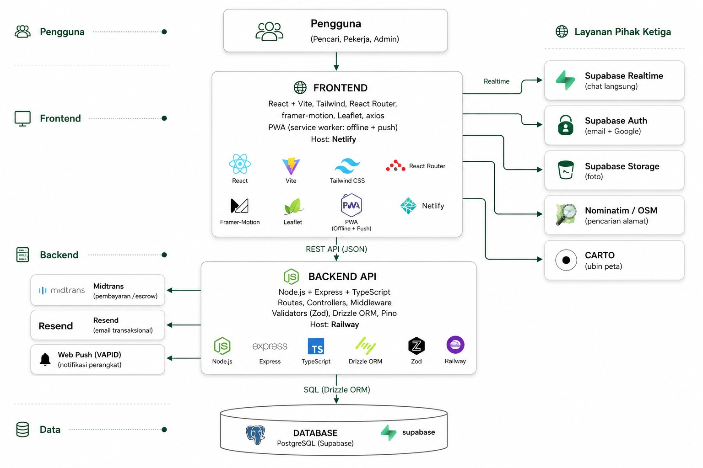

<p align="center">
  
</p>

<h1 align="center">Torano</h1>

<p align="center">
  Platform web untuk menghubungkan warga Manado dengan pekerja informal terverifikasi — ART, tukang, kru acara, dan montir.
</p>

<p align="center">
  <a href="#tentang-proyek">Tentang</a> ·
  <a href="#fitur">Fitur</a> ·
  <a href="#arsitektur--diagram">Arsitektur</a> ·
  <a href="#tech-stack">Tech Stack</a> ·
  <a href="#quick-start">Quick Start</a> ·
  <a href="#dokumentasi">Dokumentasi</a>
</p>

<p align="center">
  
  
  
  
</p>

---

## Daftar Isi

- [Tentang Proyek](#tentang-proyek)
- [Fitur](#fitur)
- [Arsitektur & Diagram](#arsitektur--diagram)
- [Tech Stack](#tech-stack)
- [Struktur Folder](#struktur-folder)
- [Quick Start](#quick-start)
- [Environment Variable](#environment-variable)
- [Menjalankan Aplikasi](#menjalankan-aplikasi)
- [API Overview](#api-overview)
- [Batasan & Ruang Lingkup](#batasan--ruang-lingkup)
- [Dokumentasi](#dokumentasi)
- [Tim](#tim)

---

## Tentang Proyek

**Torano** adalah platform jasa lokal berbasis web yang mempertemukan **pencari jasa** dengan **mitra pekerja informal** di Kota Manado. Pelanggan dapat mencari pekerja berdasarkan kategori dan lokasi, melihat profil beserta ulasan, bernegosiasi lewat chat, lalu membayar melalui gateway pembayaran dengan mekanisme **escrow** (dana ditahan sistem sampai pekerjaan selesai).

Proyek ini terdiri dari dua bagian:

| Folder      | Peran                                                                                   |
| ----------- | --------------------------------------------------------------------------------------- |
| `frontend/` | Antarmuka pengguna (React + Vite), responsif mobile-first, dapat di-install sebagai PWA |
| `backend/`  | REST API (Express + TypeScript + Drizzle ORM) terhubung ke PostgreSQL di Supabase       |

**Empat kategori layanan utama:**

| Kategori           | Contoh pekerjaan                           |
| ------------------ | ------------------------------------------ |
| ART & Bersih Rumah | Pembersih rumah, laundry, setrika, memasak |
| Tukang Harian      | Bangunan, cat, kayu, las, perbaikan        |
| Kru Acara & Adat   | Dekorasi, sound system, MC, foto & video   |
| Montir Panggilan   | Servis motor, mobil, kelistrikan           |

---

## Fitur

### Pencari Jasa (Customer)

- Registrasi & login via **email/password** atau **Google OAuth** (Supabase Auth)
- Pencarian pekerja berdasarkan kategori, kata kunci, dan jarak
- Tampilan daftar dan **peta sebaran pekerja** (OpenStreetMap + Leaflet)
- Profil pekerja terverifikasi (skill, tarif, rating, ulasan, lokasi)
- Chat 1-lawan-1 dengan pekerja, termasuk **penawaran harga** di dalam chat
- Pembayaran via **Midtrans Snap** (mode sandbox) dengan escrow
- Permintaan pekerjaan langsung ke pekerja
- Rating & ulasan setelah pekerjaan selesai
- Pelaporan pekerja dan kotak saran
- Notifikasi aktivitas (chat, pekerjaan, ulasan)
- Profil akun pelanggan

### Mitra Pekerja (Worker)

- Pendaftaran mitra melalui wizard (data diri, keahlian, wilayah, tarif, foto, lokasi)
- Pengelolaan portofolio, referensi, dan rekening pencairan
- Pengajuan verifikasi ke admin
- Dashboard ringkasan aktivitas
- Pengaturan ketersediaan (tersedia / tidak tersedia)
- Jadwal & manajemen status pekerjaan
- Chat dengan pelanggan dan negosiasi harga
- Riwayat ulasan dan ringkasan penghasilan
- Pengajuan penarikan dana

### Admin

- Login terpisah (username/password, bukan Supabase Auth)
- Dashboard analitik (transaksi, escrow, pengguna)
- Verifikasi pengajuan mitra (setujui / tolak)
- Manajemen pengguna (aktif/nonaktif)
- Monitoring transaksi & pemrosesan penarikan dana
- Penanganan sengketa (dispute)
- Moderasi laporan dari pengguna
- Pengaturan platform

### Platform

- Supabase Auth, Storage (unggahan gambar), dan Realtime (chat)
- Validasi request dengan Zod
- Structured logging (Pino) dan request ID
- Web Push & prompt instalasi PWA
- Email transaksional via Resend (opsional)
- Migrasi database dengan Drizzle Kit

---

## Arsitektur & Diagram

### Arsitektur Sistem

Diagram berikut menunjukkan hubungan antar komponen: browser pengguna, frontend React, backend Express, serta layanan Supabase dan Midtrans.

<p align="center">
  
</p>

### Diagram Use Case

Diagram use case menggambarkan interaksi aktor utama — **Pencari Jasa**, **Mitra Pekerja**, **Admin**, dan **Sistem Pembayaran (Midtrans)** — dengan sistem Torano.

<p align="center">
  
</p>

### Alur Request Backend

```text
HTTP Request
  → Route
  → Middleware (auth / validasi)
  → Controller
  → Drizzle ORM
  → PostgreSQL (Supabase)
  → Response JSON terstandar
```

---

## Tech Stack

| Lapisan             | Teknologi                                                                           |
| ------------------- | ----------------------------------------------------------------------------------- |
| **Frontend**        | React 18, Vite, React Router, Tailwind CSS 4, Framer Motion, Leaflet, Axios, Sonner |
| **Backend**         | Node.js, Express 5, TypeScript, Drizzle ORM, Zod, Pino                              |
| **Database & Auth** | PostgreSQL, Supabase (Auth, Storage, Realtime)                                      |
| **Pembayaran**      | Midtrans Snap (sandbox)                                                             |
| **Peta**            | OpenStreetMap + Leaflet                                                             |
| **Email**           | Resend (opsional)                                                                   |

**Tabel database utama:** `profiles`, `categories`, `worker_applications`, `worker_portfolios`, `worker_references`, `payout_accounts`, `bookings`, `reviews`, `payments`, `withdrawals`, `conversations`, `messages`, `disputes`, `reports`, `push_subscriptions`, `app_settings`

Skema relasi lengkap tersedia di [`docs/erd-torano.drawio`](docs/erd-torano.drawio) (buka dengan [draw.io](https://app.diagrams.net/)).

---

## Struktur Folder

```text
torano/
├── docs/                        # Diagram arsitektur, use case, ERD, SRS
├── backend/
│   ├── drizzle/                 # File migrasi
│   ├── src/
│   │   ├── config/              # Environment, database, Supabase
│   │   ├── controllers/         # Handler bisnis per fitur
│   │   ├── db/schema/           # Definisi tabel Drizzle
│   │   ├── middleware/          # Auth, logging, error handler
│   │   ├── routes/              # Endpoint Express
│   │   ├── shared/              # Logger, Midtrans, email, push
│   │   └── validators/          # Schema Zod
│   └── server.ts
├── frontend/
│   ├── public/                  # PWA manifest, service worker, ikon
│   └── src/
│       ├── assets/              # Gambar & ilustrasi UI
│       ├── components/          # Komponen reusable & landing
│       ├── layouts/             # Layout customer, worker, admin
│       ├── lib/                 # API client, auth, Supabase
│       ├── pages/               # Halaman per peran
│       └── routes/              # React Router
└── README.md
```

---

## Quick Start

### Prasyarat

- Node.js 20+
- npm
- Proyek Supabase aktif (PostgreSQL, Auth, Storage)

### 1. Clone & install

```bash
git clone <repository-url>
cd torano

cd backend && npm install
cd ../frontend && npm install
```

### 2. Konfigurasi environment

```bash
# Backend
cp backend/.env.example backend/.env

# Frontend
cp frontend/.env.example frontend/.env
```

Isi `DATABASE_URL`, `SUPABASE_URL`, `SUPABASE_ANON_KEY`, dan kredensial admin. Lihat [Environment Variable](#environment-variable) untuk detail.

### 3. Siapkan database

```bash
cd backend
npm run db:migrate
npm run db:seed
npm run db:setup-storage    # bucket Supabase Storage
npm run db:setup-realtime   # enable Realtime untuk chat
```

> Jalankan migrasi dan seed **hanya** pada database development. Periksa `DATABASE_URL` sebelum menjalankan.

### 4. Jalankan

Terminal 1 — backend (`http://localhost:5000`):

```bash
cd backend
npm run dev
```

Terminal 2 — frontend (`http://localhost:5173`):

```bash
cd frontend
npm run dev
```

---

## Environment Variable

### Backend (`backend/.env`)

| Variable                 | Wajib | Keterangan                                              |
| ------------------------ | :---: | ------------------------------------------------------- |
| `DATABASE_URL`           |  ✅   | Connection string PostgreSQL (Supabase)                 |
| `SUPABASE_URL`           |  ✅   | URL proyek Supabase                                     |
| `SUPABASE_ANON_KEY`      |  ✅   | Supabase anonymous key                                  |
| `CORS_ORIGIN`            |  ✅   | Origin frontend, pisahkan dengan koma                   |
| `APP_URL`                |  ❌   | URL frontend untuk tautan email                         |
| `ADMIN_USERNAME`         |  ❌   | Username login admin                                    |
| `ADMIN_PASSWORD`         |  ❌   | Password login admin                                    |
| `ADMIN_SECRET`           |  ❌   | Secret penandatangan token sesi admin                   |
| `MIDTRANS_SERVER_KEY`    |  ❌   | Kunci server Midtrans (sandbox: `SB-Mid-server-...`)    |
| `MIDTRANS_CLIENT_KEY`    |  ❌   | Kunci client Midtrans                                   |
| `MIDTRANS_IS_PRODUCTION` |  ❌   | `false` untuk sandbox                                   |
| `RESEND_API_KEY`         |  ❌   | API key Resend (email opsional)                         |
| `VAPID_PUBLIC_KEY`       |  ❌   | Web Push (generate: `npx web-push generate-vapid-keys`) |
| `VAPID_PRIVATE_KEY`      |  ❌   | Web Push private key                                    |

### Frontend (`frontend/.env`)

| Variable                 | Wajib | Keterangan                                       |
| ------------------------ | :---: | ------------------------------------------------ |
| `VITE_SUPABASE_URL`      |  ✅   | URL proyek Supabase                              |
| `VITE_SUPABASE_ANON_KEY` |  ✅   | Supabase anonymous key                           |
| `VITE_API_BASE_URL`      |  ✅   | Base URL API, contoh `http://localhost:5000/api` |

> Variabel `VITE_*` tersedia di browser. Jangan masukkan service-role key, password database, atau secret admin ke frontend.

---

## Menjalankan Aplikasi

### Development

```bash
# Backend
cd backend && npm run dev

# Frontend (terminal terpisah)
cd frontend && npm run dev
```

### Production build

```bash
# Backend
cd backend
npm run typecheck && npm run build && npm start

# Frontend
cd frontend
npm run build && npm run preview
```

### Script database tambahan

```bash
cd backend
npm run db:seed:workers     # Seed data pekerja
npm run db:seed:demo        # Seed akun demo
npm run db:make-admin       # Buat akun admin
npm run db:studio           # Drizzle Studio (GUI database)
```

---

## API Overview

Base URL development: `http://localhost:5000/api`

Endpoint dengan **Auth** membutuhkan header `Authorization: Bearer <supabase_access_token>`.  
Endpoint **Admin** membutuhkan token dari `POST /admin/login`.

| Modul            | Prefix           | Contoh endpoint                                            |
| ---------------- | ---------------- | ---------------------------------------------------------- |
| Health           | `/health`        | `GET /health`, `GET /health/database`                      |
| Auth             | `/auth`          | `POST /register`, `POST /login`, `GET /me`                 |
| Kategori         | `/categories`    | `GET /`                                                    |
| Pekerja (publik) | `/workers`       | `GET /`, `GET /:id`                                        |
| Area pekerja     | `/worker`        | `GET /me/dashboard`, `PATCH /me/bookings/:id/status`       |
| Chat             | `/chat`          | `GET /conversations`, `POST /conversations/:id/messages`   |
| Pembayaran       | `/payments`      | `POST /offer`, `POST /:id/snap`, `POST /:id/release`       |
| Permintaan       | `/requests`      | `POST /`                                                   |
| Ulasan           | `/reviews`       | `POST /`                                                   |
| Sengketa         | `/disputes`      | `POST /`                                                   |
| Laporan          | `/reports`       | `POST /`, `GET /me`                                        |
| Feedback         | `/feedback`      | `POST /`                                                   |
| Notifikasi       | `/notifications` | `GET /`                                                    |
| Push             | `/push`          | `POST /subscribe`                                          |
| Admin            | `/admin`         | `GET /dashboard`, `PATCH /worker-applications/:id/approve` |

**Format respons sukses:**

```json
{ "success": true, "data": {} }
```

**Format respons error:**

```json
{
  "success": false,
  "error": { "code": "VALIDATION_ERROR", "message": "...", "details": [] },
  "requestId": "uuid"
}
```

Definisi lengkap setiap endpoint ada di folder [`backend/src/routes/`](backend/src/routes/).

---

## Batasan & Ruang Lingkup

Hal-hal berikut **sengaja di luar cakupan** proyek ini:

| Batasan               | Keterangan                                              |
| --------------------- | ------------------------------------------------------- |
| Aplikasi native       | Hanya web responsif + PWA, bukan Android/iOS native     |
| Pembayaran produksi   | Midtrans **sandbox** — tanpa penarikan dana riil        |
| Autentikasi nomor HP  | Login via email/password & Google, bukan OTP SMS        |
| Live tracking         | Lokasi pekerja statis, bukan pelacakan GPS real-time    |
| Panggilan suara/video | Komunikasi hanya lewat chat teks                        |
| Permintaan SOS        | Fitur broadcast pekerjaan mendesak belum diimplementasi |
| Multi-kota            | Fokus Kota Manado dan sekitarnya                        |
| Multi-bahasa          | Antarmuka Bahasa Indonesia saja                         |

Detail ruang lingkup sistem (SRS) tersedia di [`docs/SRS-ruang-lingkup.md`](docs/SRS-ruang-lingkup.md).

---

## Dokumentasi

| File                                                     | Isi                                     |
| -------------------------------------------------------- | --------------------------------------- |
| [`docs/ArsitekturSystem.png`](docs/ArsitekturSystem.png) | Diagram arsitektur sistem               |
| [`docs/Usecase Diagram.png`](docs/Usecase%20Diagram.png) | Diagram use case UML                    |
| [`docs/erd-torano.drawio`](docs/erd-torano.drawio)       | Entity Relationship Diagram (draw.io)   |
| [`docs/SRS-ruang-lingkup.md`](docs/SRS-ruang-lingkup.md) | Spesifikasi ruang lingkup & alur bisnis |

---

## Tim

<p align="center"><strong>LASALLE VIBERS</strong></p>

<p align="center">Proyek lomba — VETERNITY BERAKSI</p>
