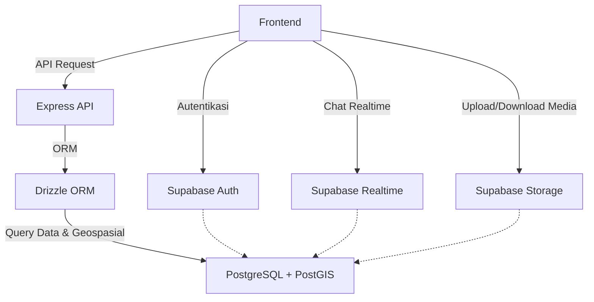

# Arsitektur Tingkat Tinggi Torano (Fase 0)

## Diagram Arsitektur

## Hubungan Komponen Utama
- **Frontend** mengakses layanan Supabase secara langsung untuk keperluan autentikasi (Auth), media (Storage), dan chat (Realtime).
- **Express API** bertugas menangani request dari Frontend untuk operasi yang memerlukan logika bisnis dan pemrosesan data kompleks, termasuk manajemen profil dan pencarian lokasi.
- **Drizzle ORM** digunakan di dalam Express API untuk berkomunikasi secara type-safe dengan database.
- **PostgreSQL + PostGIS** menyimpan seluruh data aplikasi, baik yang diakses oleh Supabase (seperti data auth dan data chat) maupun yang diakses oleh Express API (seperti profil pekerja dan koordinat).

## Alur Autentikasi
1. Pengguna (pelanggan atau pekerja) mengisi form registrasi atau login di Frontend.
2. Frontend memanggil Supabase Auth secara langsung menggunakan Supabase client.
3. Supabase Auth mengembalikan JWT (JSON Web Token) dan menyimpannya di sisi Frontend.
4. Frontend akan menyertakan JWT ini pada setiap akses ke Supabase services lain (dijaga oleh Row Level Security/RLS) atau saat melakukan HTTP request ke Express API (dijaga oleh middleware autentikasi).

## Alur Pengelolaan Profil Pekerja
1. Pekerja membuka halaman edit profil di Frontend.
2. Frontend mengirimkan request ke endpoint Express API (menyertakan JWT).
3. Express API memvalidasi request (menggunakan Zod) dan token pengguna.
4. Express API menginstruksikan Drizzle untuk menyimpan atau mengubah data di tabel `worker_profiles`.
5. Hasil kembalian (response) diteruskan oleh Express kembali ke Frontend.

## Alur Pencarian Pekerja Berdasarkan Lokasi
1. Pelanggan mencari pekerja (misalnya ART atau montir) dan mengaktifkan pencarian lokasi di Frontend.
2. Frontend mengirim HTTP request berisi parameter pencarian dan lokasi acuan ke Express API.
3. Express API melakukan sanitasi data dan mengonstruksi query PostGIS (seperti `ST_DWithin` atau `ST_Distance`) melalui Drizzle.
4. PostgreSQL + PostGIS mengeksekusi spatial query untuk menemukan pekerja terdekat.
5. Express API mengembalikan daftar pekerja ke Frontend.

## Alur Chat
1. Pengirim mengetik pesan chat di Frontend.
2. Frontend secara langsung melakukan _insert_ pesan baru ke tabel `messages` melalui Supabase client.
3. PostgreSQL menyimpan record pesan tersebut (setelah divalidasi oleh RLS).
4. Sebuah database trigger akan mendeteksi insert ini dan mengirim event pesan baru melalui **Supabase Realtime Broadcast**.
5. Frontend penerima yang sedang _subscribe_ ke _channel_ tersebut menerima broadcast dan merender pesan baru di layar tanpa harus terus-menerus melakukan _polling_ ke database.

## Batas Akses (Express vs Supabase)

**Akses Langsung via Supabase (Tanpa Express):**
- **Autentikasi**: Registrasi, login, reset password.
- **Chat Dasar**: Insert tabel `messages` dan membaca tabel `conversations` yang dilindungi oleh kebijakan RLS ketat.
- **Media**: Upload foto profil atau portofolio langsung ke bucket Supabase Storage.

**Akses via Express API:**
- **Profil & Kategori**: Create/Read/Update/Delete (CRUD) data pekerja, kategori, dan pelanggan.
- **Lokasi & PostGIS**: Operasi pembaruan lokasi dan pencarian lokasi secara radius/geospasial.
- **Operasi Admin**: Pengaturan platform yang tidak boleh diekspos secara langsung melalui RLS client.
